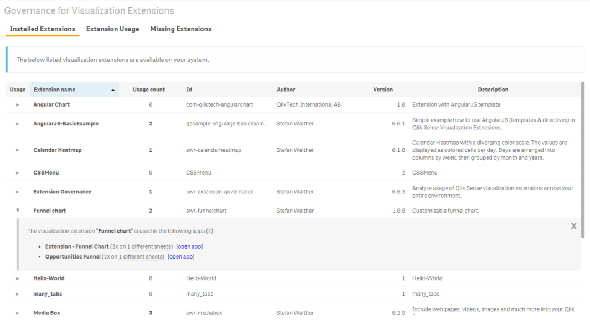
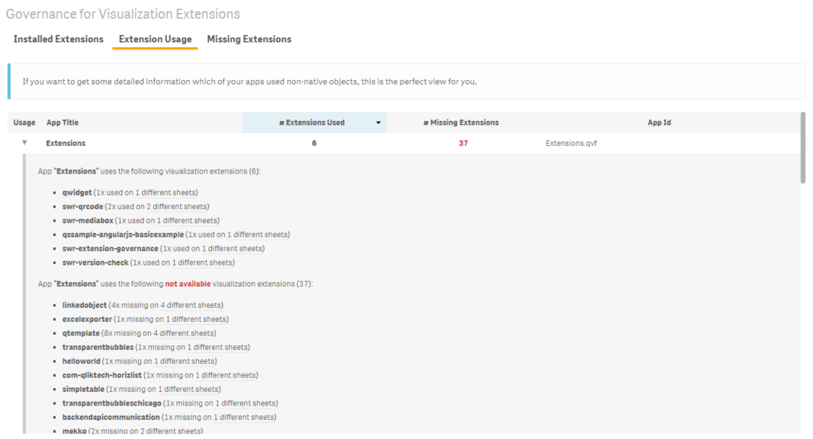
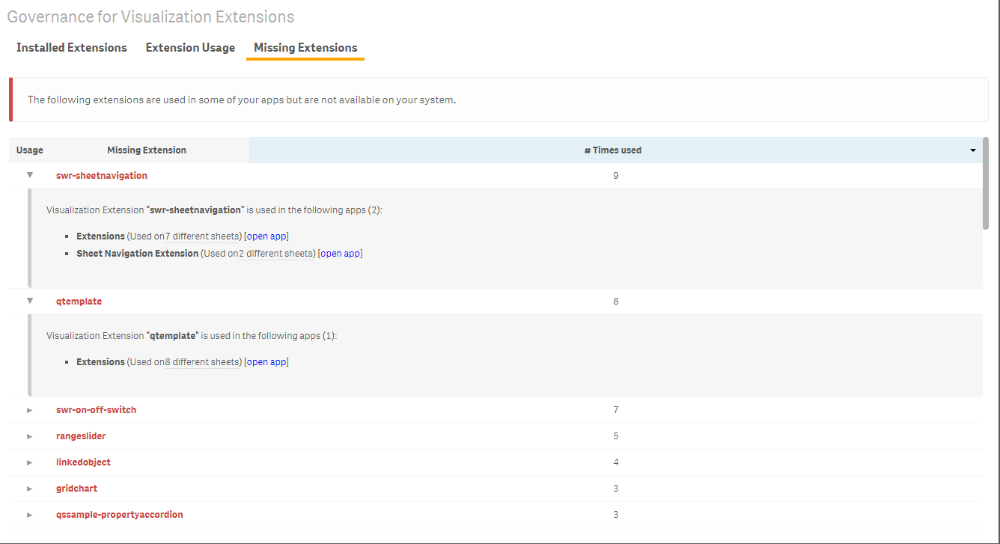

# sense-extension-governance

## Governance for Visualization Extensions in Qlik Sense

> Analyze usage of Qlik Sense visualization extensions across your entire environment.

<!-- toc -->

* [Purpose and Description](#purpose-and-description)
* [Screenshots](#screenshots)
* [Installation](#installation)
* [Usage](#usage)
* [Known Issues](#known-issues)
* [Related Projects](#related-projects)
* [Contributing](#contributing)
* [Author](#author)
* [Change Log](#change-log)
* [License & Copyright](#license---copyright)

_(Table of contents generated by [verb])_

<!-- tocstop -->

## Purpose and Description

* Did you ever want to know, where you are using a particular visualization extension?
* Did you ever want to know if you have any **broken/missing visualization extension** across your environment?
* Did you ever want to get an overview which visualization extension are used in a particular app?
* Do you want to prevent users getting an "Invalid visualization" error in your deployment because you've forgotten to install your visualization extensions properly?

If you can answer one if the questions above with YES, then this solution might be interesting for you.

## Screenshots

**List of installed extensions**

> 

**List of used extensions + apps**

> 

**List of missing extensions**

> 

## Installation

1. Download the latest version
2. Qlik Sense Desktop
  - To install, copy all files in the .zip file to folder "C:\Users[%Username%]\Documents\Qlik\Sense\Extensions\sense-extension-governance"
* Qlik Sense Server
  - See instructions [how to import an extension on Qlik Sense Server](http://help.qlik.com/sense/en-us/developer/#../Subsystems/Workbench/Content/BuildingExtensions/HowTos/deploy-extensions.htm)

## Usage

No configuration necessary and available, just install the extension and drag and drop it onto a sheet.

## Known Issues

* To run this extension **all apps must be closed**, otherwise you'll get and error message which is not fetched properly in all versions of Qlik Sense.
* Setup with a virtual proxy is not fully supported (opening an app does not work correctly)

## Related Projects

Some related projects (Qlik Sense Visualization Extensions) I have recently created:

* [qliksense-extension-tutorial](https://www.npmjs.com/package/qliksense-extension-tutorial): Comprehensive tutorial to start developing Qlik Sense Extensions. | [homepage](https://github.com/stefanwalther/qliksense-extension-tutorial)
* [sense-calendar-heatmap](https://www.npmjs.com/package/sense-calendar-heatmap): Qlik Sense Visualization Extension with a diverging color scale. The values are displayed as colored… [more](https://www.npmjs.com/package/sense-calendar-heatmap) | [homepage](https://github.com/stefanwalther/qsCalendarHeatmap)
* [sense-extension-recipes](https://www.npmjs.com/package/sense-extension-recipes): Recipes on working with Qlik Sense Visualization Extensions. | [homepage](https://github.com/stefanwalther/sense-extension-recipes)
* [sense-funnel-chart](https://www.npmjs.com/package/sense-funnel-chart): Funnel Chart for Qlik Sense. | [homepage](https://github.com/stefanwalther/sense-funnel-chart)
* [sense-media-box](https://www.npmjs.com/package/sense-media-box): Include web pages, videos, images and much more into your Qlik Sense app. | [homepage](https://github.com/stefanwalther/sense-media-box)
* [sense-on-off-switch](https://www.npmjs.com/package/sense-on-off-switch): Set a variable in Qlik Sense to true/false using an on-off switch. | [homepage](https://github.com/stefanwalther/sense-on-off-switch)
* [sense-qr-code](https://www.npmjs.com/package/sense-qr-code): QR Code to be embedded into Qlik Sense. | [homepage](https://github.com/stefanwalther/qsQRCode)
* [sense-range-slider](https://www.npmjs.com/package/sense-range-slider): Slider object for Qlik Sense to manipulate one or two variables. | [homepage](https://github.com/QlikDev/qsRangeSlider)
* [sense-themable-kpi-tile](https://www.npmjs.com/package/sense-themable-kpi-tile): KPI Tile for Qlik Sense with the ability to use themes or to customize background… [more](https://www.npmjs.com/package/sense-themable-kpi-tile) | [homepage](https://github.com/stefanwalther/sense-themable-kpi-tile)

## Contributing

Contributing to this project is welcome. The process to do so is outlined below:

1. Create a fork of the project
2. Work on whatever bug or feature you wish
3. Create a pull request (PR)

I cannot guarantee that I will merge all PRs but I will evaluate them all.

## Author

**Stefan Walther**

+ [qliksite.io](http://qliksite.io)
* [twitter/waltherstefan](http://twitter.com/waltherstefan)
* [github.com/stefanwalther](http://github.com/stefanwalther)

## Change Log

See [CHANGELOG.yml](CHANGELOG.yml)

## License & Copyright

Copyright © 2015 Stefan Walther
Released under the MIT license.

***

_This file was generated by [verb-cli](https://github.com/assemble/verb-cli) on November 06, 2015._